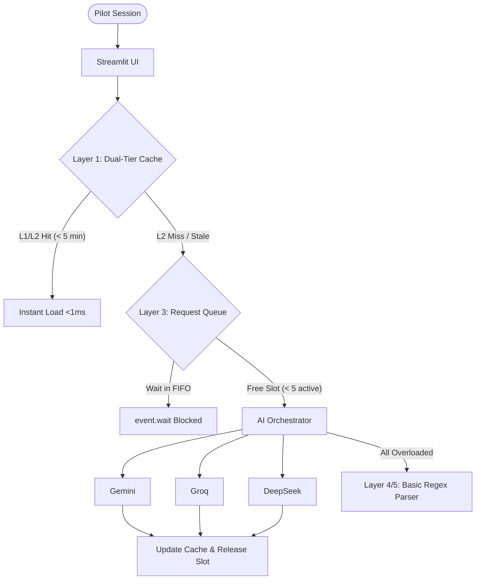

# 🛫 ATC Weather Assistant - AI-Powered Pilot Briefing System

[](https://weatherbriefing.streamlit.app)
[](https://www.python.org/)
[](https://opensource.org/licenses/MIT)

> **"Finally understand METAR & TAF reports without your CFI."** 
> An advanced, AI-powered weather decoding, safety-assessment, and educational platform built specifically for student pilots and flight instructors.

### 🌐 **Live Web Application:** [weatherbriefing.streamlit.app](https://weatherbriefing.streamlit.app)

---

## 🚀 Why ATC Weather Assistant?

Aviation weather reports (METAR and TAF) are notoriously cryptic. Reading them is a critical checkride skill, but interpreting their real-world impact on safety can be overwhelming for student pilots. 

**ATC Weather Assistant** translates raw meteorological data into professional plain-English briefings, evaluates conditions against strict pilot personal minimums, and generates hands-free audio briefings—all with a state-of-the-art backend built to survive heavy, viral traffic spikes.

---

## ✨ Core Selling Points & Features

### 🤖 1. Dual-Engine AI Decoders
Never see "AI unavailable" errors. The app runs a primary analysis via **Google Gemini 2.5 Flash**, backed by an automatic failover sequence to **Groq (Llama 3.3)** and **DeepSeek**, and falls back to a precise local regex parser if the internet is completely offline.

### 🛡️ 2. Smart Student Safety Evaluator (GO / NO-GO)
Input an ICAO code and get an immediate, definitive safety decision. The system evaluates:
* **Max Crosswinds**: Strict 10-knot limit.
* **Ceiling & Visibility**: Min 3,000 ft ceiling and 5 statute miles visibility.
* **Gust Spread**: Maximum 10-knot deviation.
* **Convective Hazards**: Absolute block on Thunderstorms, Low-Level Wind Shear (LLWS), and Icing.

### 🎙️ 3. Hands-Free Voice Briefings
Pre-flight planning should be eyes-free. Synthesize professional audio voice briefs of current and forecast conditions with a single click, allowing pilots to listen while performing pre-flight walkarounds.

### 📚 4. Student Pilot Learning Corner (Checkride Prep)
Includes a line-by-line interactive explanation of weather abbreviations. Learn exactly what `TEMPO`, `BECMG`, and hazard codes mean, and test your knowledge with a simulated **Private Pilot Checkride Oral Exam Q&A** dynamically generated based on the day's actual weather.

### ⚡ 5. Popular Airport Pre-Caching
Instant load times for high-traffic global hubs (like VIDP, VABB, KJFK, EGLL, OMDB). Pre-cached weather loads in `< 1ms` with **zero API requests** incurred.

---

## ⚙️ Enterprise-Grade Protection System (Under the Hood)

To support hundreds of concurrent users without hitting API rate limits or incurring costly paid calls, the application implements a robust **protection architecture**:



* **⚡ Aggressive Dual-Tier Caching**: Uses a thread-safe L1 memory cache and L2 disk cache. If a METAR hasn't changed, the result is instant. If weather is updated at the airport, the cache auto-invalidates, serving fresh data instantly.
* **⏳ Thread-Locked Request Queue**: Marshalls incoming parallel requests into a synchronous sequential FIFO queue. No more 429 rate limit exceptions under heavy viral load.
* **🚦 Graceful Degradation (High Traffic Mode)**: If AI engines are fully rate-limited, the app displays a professional load warning and falls back to a fast, non-AI basic parser without blocking the user.

---

## 🛠️ Technology Stack

* **Frontend UI**: Streamlit (Ultra-premium custom styling, custom tailormade HSL color palette, dark mode styles).
* **AI Orchestration**: Google GenAI SDK (Gemini 2.5), Groq SDK (Llama 3.3), OpenAI SDK (DeepSeek).
* **Schema Validation**: Pydantic v2.
* **Voice Synthesis**: gTTS (Google Text-to-Speech).
* **Data Provider**: Live Aviation Weather Center API (aviationweather.gov).

---

## 🚀 Local Installation & Quickstart

Want to run the codebase locally or deploy your own copy?

### 1. Initialize Virtual Environment
```bash
git clone https://github.com/sjha16/metar.git
cd metar
python -m venv .venv
```

Activate the environment:
* **Windows (PowerShell)**: `.venv\Scripts\Activate.ps1`
* **macOS/Linux**: `source .venv/bin/activate`

### 2. Install Dependencies
```bash
pip install -r requirements.txt
```

### 3. Set Up API Credentials
Create a `.env` file in the root directory:
```env
GEMINI_API_KEY="your_gemini_api_key"
GROQ_API_KEY="your_groq_api_key"
DEEPSEEK_API_KEY="your_deepseek_api_key_optional"
```

### 4. Run the App
```bash
streamlit run app.py
```
Open [http://localhost:8501](http://localhost:8501) and experience the assistant!

---

## 📄 License

This project is licensed under the MIT License - see the [LICENSE](LICENSE) file for details.

---

**Developed for pilots, by aviators. Fly safe! 🛫**
